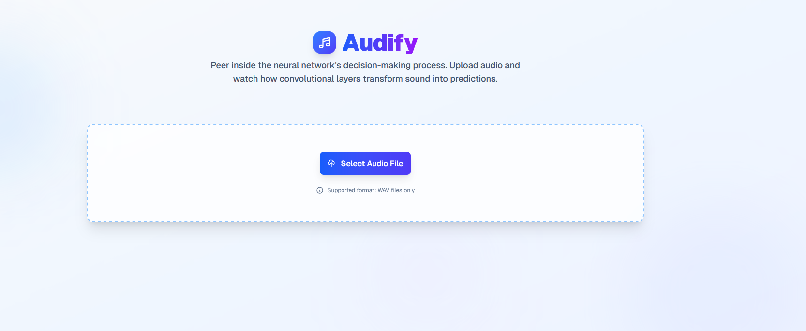
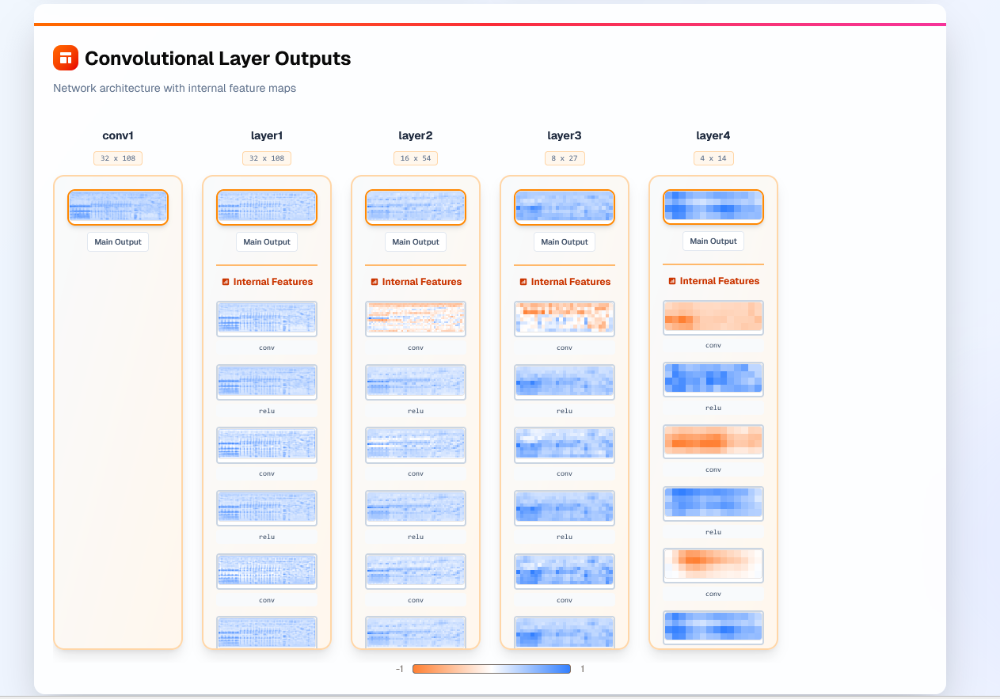
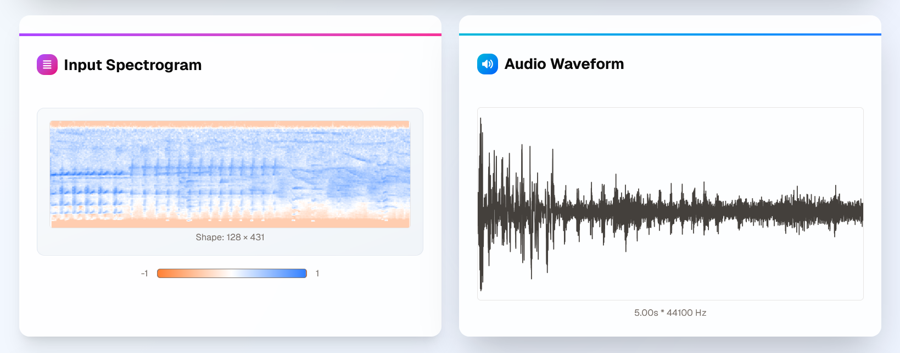

🎧 Audify — AI-Powered Environmental Sound Classification

Audify is an end-to-end deep learning system for classifying real-world environmental sounds using convolutional neural networks (CNNs). The project demonstrates a complete ML workflow — from raw audio preprocessing and feature extraction to model inference, interpretability, and deployment.

  

🚀 Overview

Environmental sound understanding is a key problem in audio intelligence. Audify solves this by converting raw audio signals into log Mel-spectrograms and using a CNN to learn meaningful audio representations for accurate sound classification.

The system is designed for real-time inference, model transparency, and scalability, making it suitable for practical AI applications.

✨ Features

🎵 Classification of 50 environmental sound classes

🧠 CNN-based deep learning model

🔊 Log Mel-spectrogram feature extraction

🧪 Data augmentation (SpecAugment)

⚡ Real-time audio inference

📊 Top-K predictions with confidence scores

🔍 CNN feature map visualization for model interpretability

🌐 Scalable deployment using cloud GPU infrastructure

📊 Classification Results

Audify outputs ranked predictions along with confidence scores for each detected sound class.

  

🔊 Audio Representation

Raw audio waveforms are converted into log Mel-spectrograms before being passed to the neural network. Both the waveform and spectrogram are visualized to provide insight into the input representation.

  

🧠 Model Interpretability — Feature Map Visualization

To improve transparency, Audify visualizes intermediate CNN feature maps. This allows users to observe how convolutional layers progressively extract higher-level audio features from raw spectrograms.

  

🏗️ Model Architecture

Convolutional Neural Network (CNN)

Stacked convolution + ReLU blocks

Batch normalization and dropout for regularization

Adaptive average pooling

Fully connected classification head

The model is trained on log Mel-spectrograms derived from raw audio signals.

🗂️ Dataset

ESC-50 Dataset

2,000 labeled environmental audio clips

50 classes × 40 clips per class

Each clip is 5 seconds long

Balanced dataset suitable for benchmarking

🏋️ Training Details

Framework: PyTorch

Audio Processing: Torchaudio

Loss Function: Cross-Entropy Loss

Optimizer: Adam

Batch Size: 32

Augmentation Techniques:

Time Masking

Frequency Masking

🌐 Deployment

Audify is deployed as a scalable inference service using Modal, enabling GPU-accelerated audio classification through an API interface.

Inference pipeline:

Audio upload

Preprocessing and normalization

Feature extraction

CNN inference

Top-K prediction output

📦 Tech Stack

Language: Python

Deep Learning: PyTorch

Audio Processing: Torchaudio, Librosa

Model Type: Convolutional Neural Networks (CNNs)

Deployment: Modal

Visualization: Matplotlib

🎯 Use Cases

Environmental monitoring systems

Smart surveillance applications

Audio-based event detection

Assistive technologies

AI/ML research and experimentation

📈 Future Enhancements

Multi-label sound classification

Streaming audio support

Attention-based architectures

Explainability techniques (Grad-CAM for audio)

Mobile-friendly inference endpoints

👤 Author

Aprajita Ranjan

GitHub: https://github.com/ARanjan45

LinkedIn: https://www.linkedin.com/in/aprajita-ranjan-961a0523b

⭐ Why Audify?

Audify showcases strong fundamentals in audio signal processing, deep learning, model interpretability, and production deployment, making it a solid project for AI/ML internships and research roles.